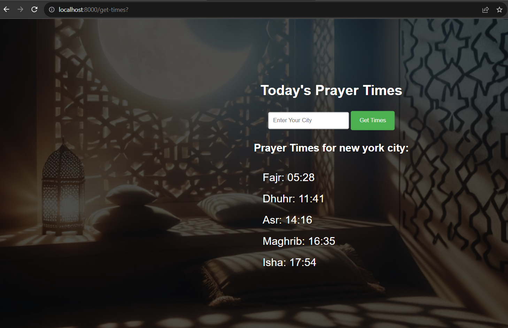

# Athan Prayer Times Web App 🕌

## Introduction

Athan (also spelled Adhan) 📣 is the Islamic call to prayer, traditionally given by a muezzin from a minaret of a mosque five times a day to summon Muslims for mandatory worship. As one of the most profound symbols of Islamic faith, it resonates deeply with Muslims worldwide, symbolizing discipline, spirituality, and unity.

This web app, **Athan Prayer Times**, is designed to help Muslims organize their daily prayers by providing accurate prayer times based on their current location or a city of their choice. 🌍

## Features

- **Automatic Geolocation**: The app automatically detects the user's current location to display prayer times. (Note: Requires user permission for geolocation access. 🛰️)
- **City-based Times**: Users can also manually enter a city name to get prayer times. 🏙️
- **Responsive Design**: Sleek, modern, and responsive design suitable for various devices. 📱💻
- **Hero Image Background**: Features a calming and thematic hero image as the background. 🖼️

## How It Works

1. **Geolocation**: On loading the app, it attempts to fetch the user's geographical location. If the user permits, it shows prayer times based on this location.
2. **Manual City Input**: Users can input any city's name to get the corresponding prayer times.
3. **Prayer Times Display**: The app displays the following prayer times:
   - Fajr (pre-dawn)
   - Dhuhr (midday after the sun passes its highest)
   - Asr (the late part of the afternoon)
   - Maghrib (just after sunset)
   - Isha (night)

## Setup and Running the Project

1. **Clone the Repository**: Clone this project to your local machine.
2. **Install Dependencies**: Make sure Python and Django are installed.
3. **Run the Django Server**:
   ```
   python manage.py runserver
   ```
4. **Access the App**: Open a web browser and navigate to `http://localhost:8000/`.

## Technologies Used

- **Backend**: Python with Django Framework 🐍
- **Frontend**: HTML, CSS, JavaScript
- **API**: Utilizes the Aladhan API for fetching prayer times. 🌐

## Contributions

Contributions, issues, and feature requests are welcome! Feel free to fork this repository and submit pull requests. 🤝

## License

This project is licensed under the [MIT License](LICENSE).

---

Thank you for using or contributing to Athan Prayer Times! May it help you in maintaining your prayer discipline and spiritual journey. 🌟
